# STM32F401 Environment Monitor — E-paper SSD1680 + XY-MD02 (Modbus RTU)

Firmware FreeRTOS untuk STM32F401CCU6 (Blackpill): baca suhu/kelembapan dari sensor
Modbus RTU XY-MD02 tiap 10 detik, tampilkan ke e-paper SSD1680 (WeAct 2.13") tiap 60
detik. **Status: TERUJI JALAN DI HARDWARE** — lihat bagian [Hasil Pengujian](#hasil-pengujian) di bawah.

## Hasil Pengujian

### Rangkaian fisik

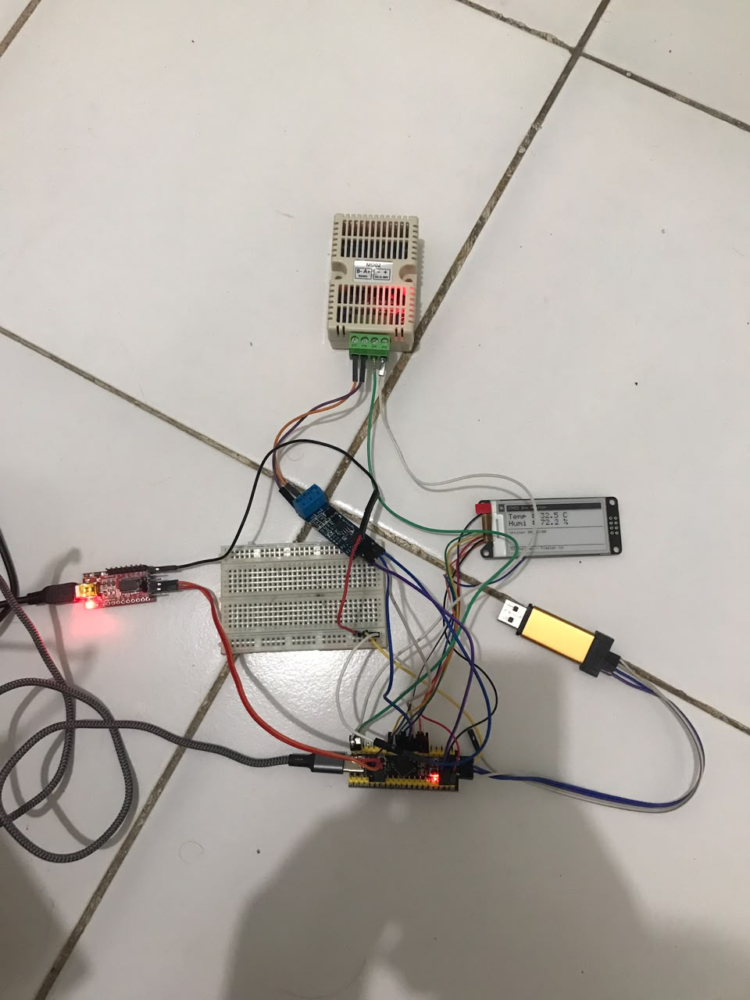

Blackpill STM32F401CCU6, sensor XY-MD02 (RS485), modul RS485-ke-UART, dan e-paper SSD1680 dirangkai di breadboard. USB-TTL kiri untuk debug USART1, kabel biru ke e-paper untuk power dari sumber terpisah.

### Tampilan e-paper (hasil akhir)

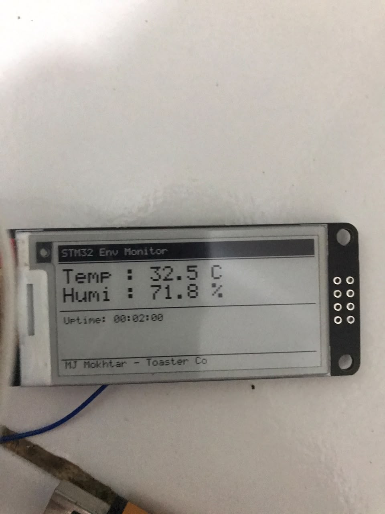

Layout final: header "STM32 Env Monitor", baris Temp/Humi, uptime, footer credit — sesuai desain di `RenderSensorData()`.

### Log serial debug (USART1, 115200 8N1, via Hercules Setup Utility)

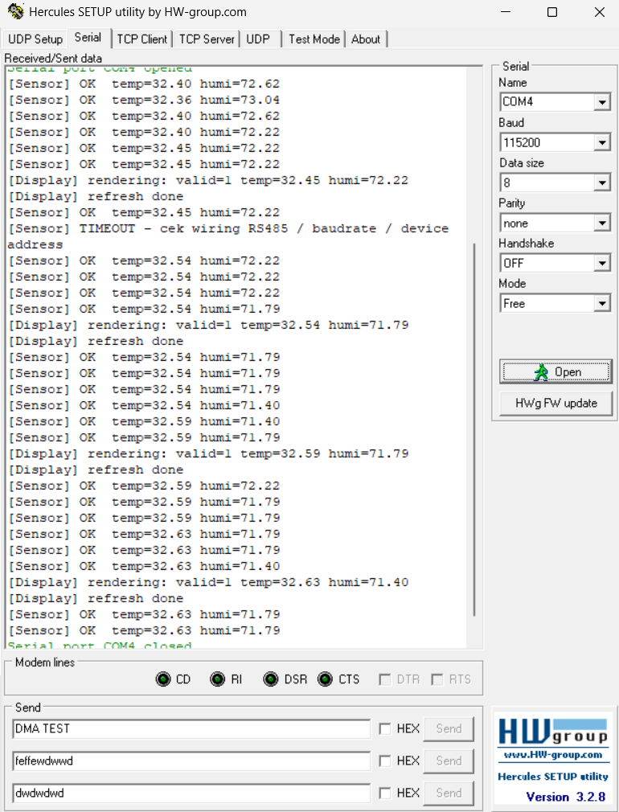

Terlihat pola normal: `[Sensor] OK` tiap ~10 detik, `[Display] rendering/refresh done` tiap ~60 detik, dan sesekali `[Sensor] TIMEOUT` (noise RS485 sesaat, bukan bug — lihat bagian [Known Issues](#known-issues--catatan-final)).

## Fitur

- Baca sensor suhu & kelembapan (XY-MD02) via Modbus RTU RS485, interval 10 detik
- Tampilkan ke e-paper 2.13" (SSD1680), refresh interval tetap 60 detik (bukan tiap ada data baru — supaya hemat siklus refresh panel)
- Panel e-paper tidur (`epd_sleep()`) di antara refresh untuk hemat daya
- Dua FreeRTOS task terpisah (Sensor + Display) — blocking refresh e-paper (2–8 detik) tidak pernah menunda pembacaan sensor berikutnya
- Debug log via USART1 (115200 8N1) — status tiap siklus baca sensor & refresh display
- Tanpa network (WiFi/4G LTE) — standalone sensor-to-display

## IO / Pin yang Dipakai (Final, Confirmed Working)

MCU: **STM32F401CCU6** (Blackpill, UFQFPN48) — SYSCLK 84 MHz (HSE 25MHz → PLLM=25, PLLN=168, PLLP=2), APB1 42MHz, APB2 84MHz.
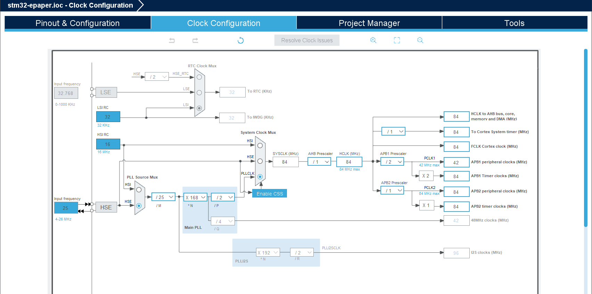

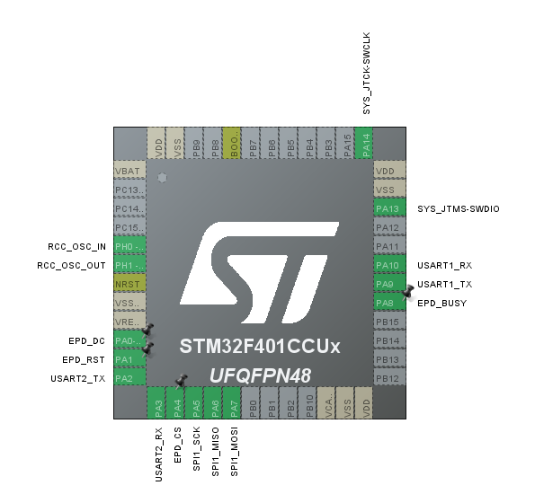

### E-paper SSD1680 (WeAct 2.13") — SPI1

| Pin MCU | Fungsi | Keterangan |
|---|---|---|
| PA5 | SCK  | SPI1 hardware AF |
| PA6 | MISO | SPI1 hardware AF, tidak dipakai epaper (write-only) tapi tetap dikonfigurasi |
| PA7 | MOSI | SPI1 hardware AF |
| PA4 | CS   | GPIO manual output, High saat idle (**software NSS**, bukan hardware NSS) |
| PA0 | DC   | GPIO output (Data/Command) |
| PA1 | RST  | GPIO output |
| PA8 | BUSY | GPIO input, no pull |
| 3.3V | VCC | — |
| GND | GND | — |

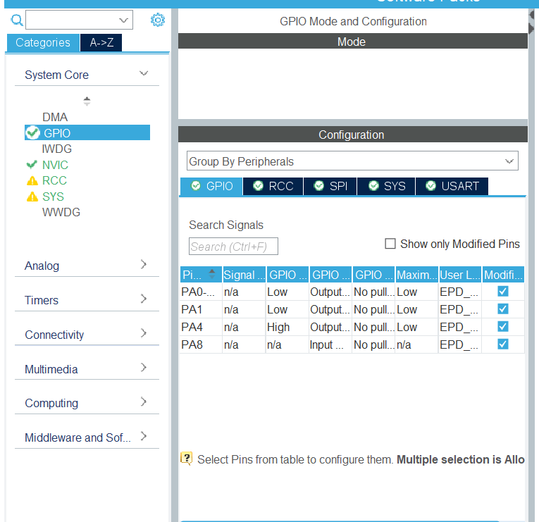
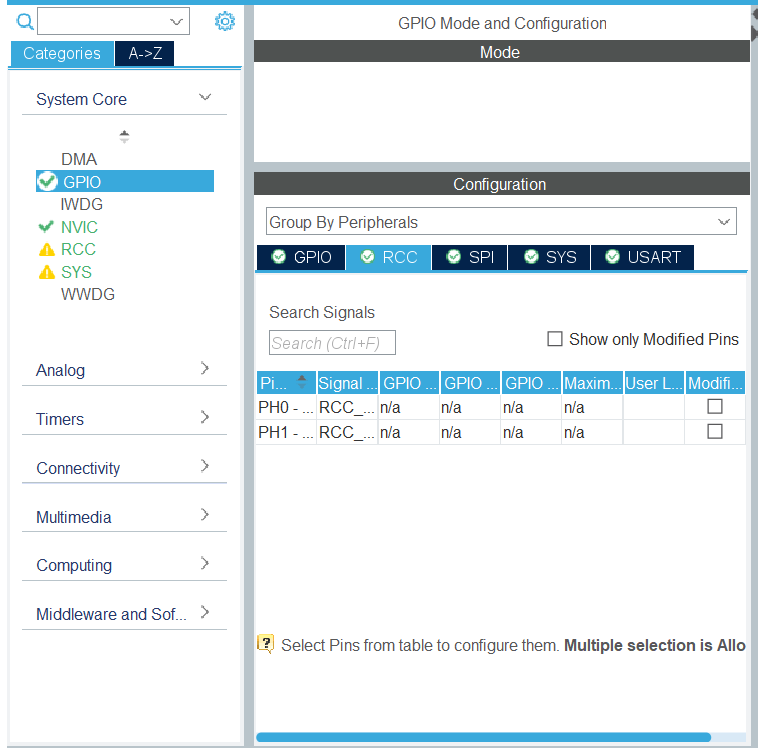
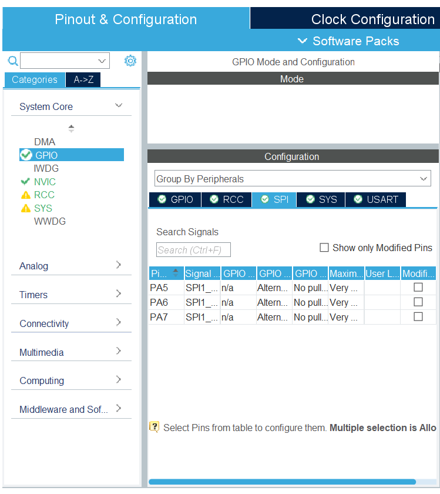
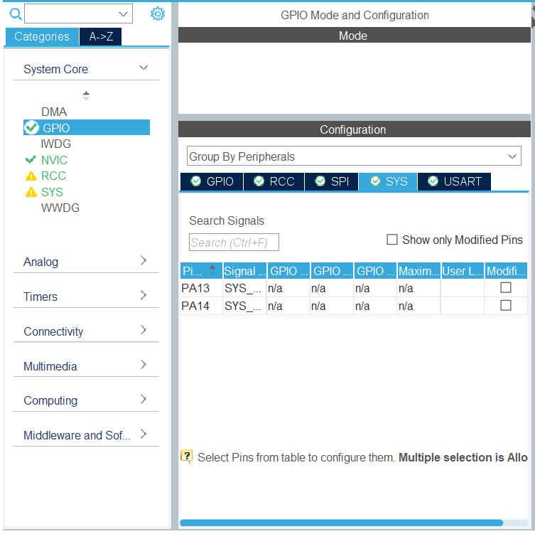
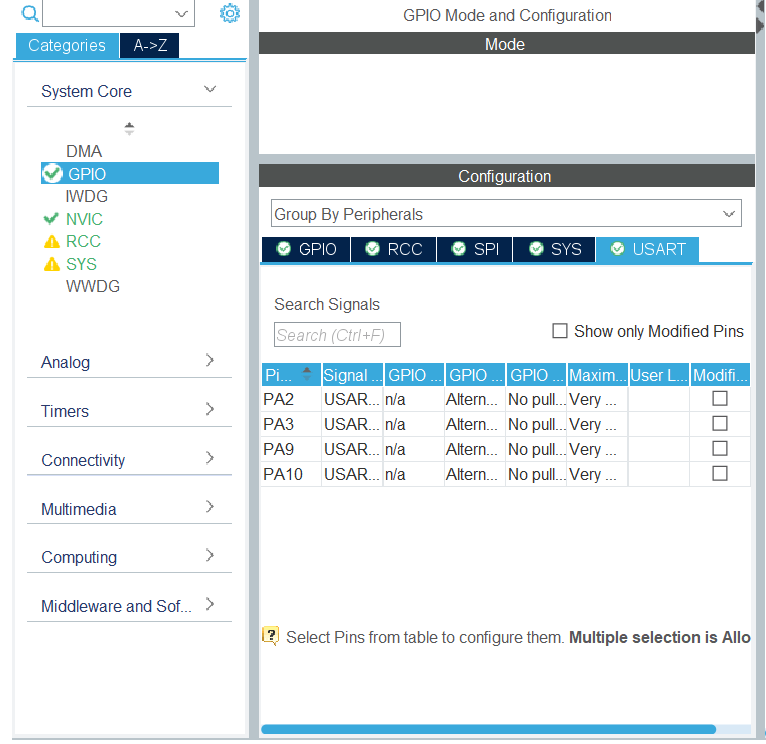
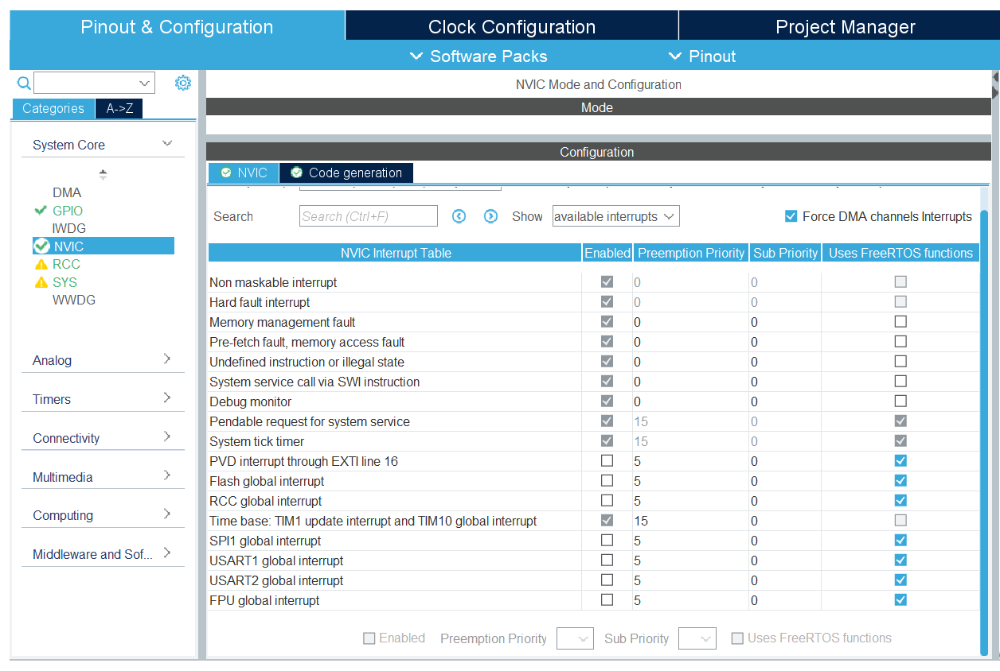
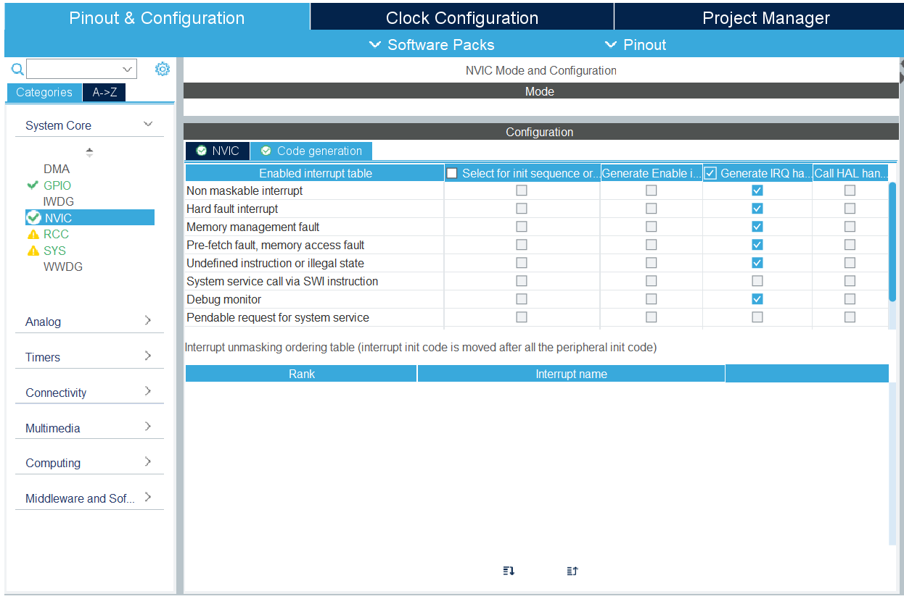
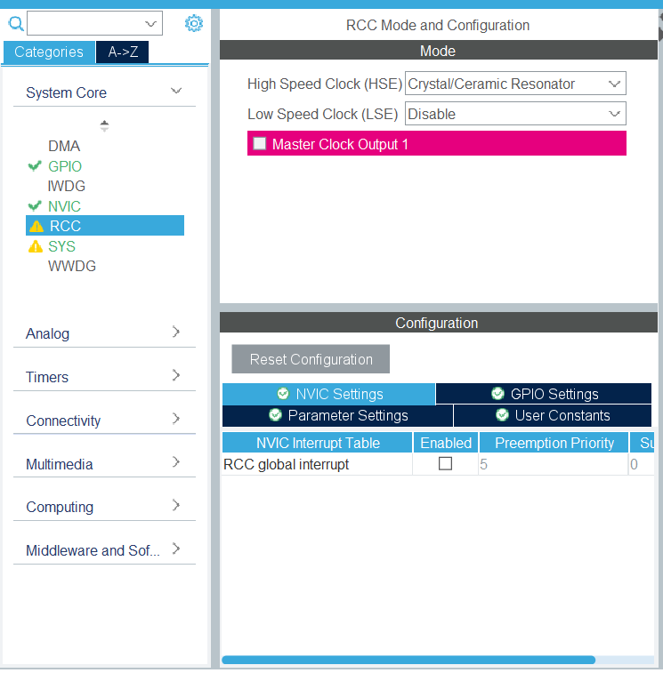
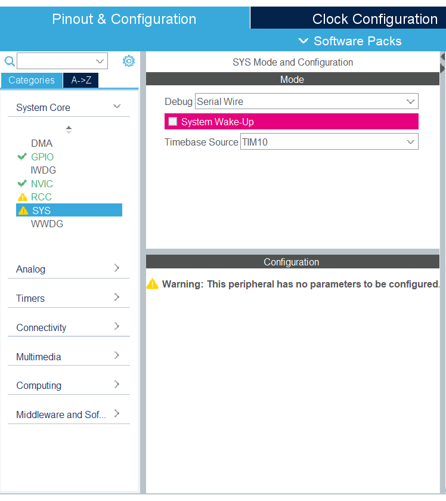
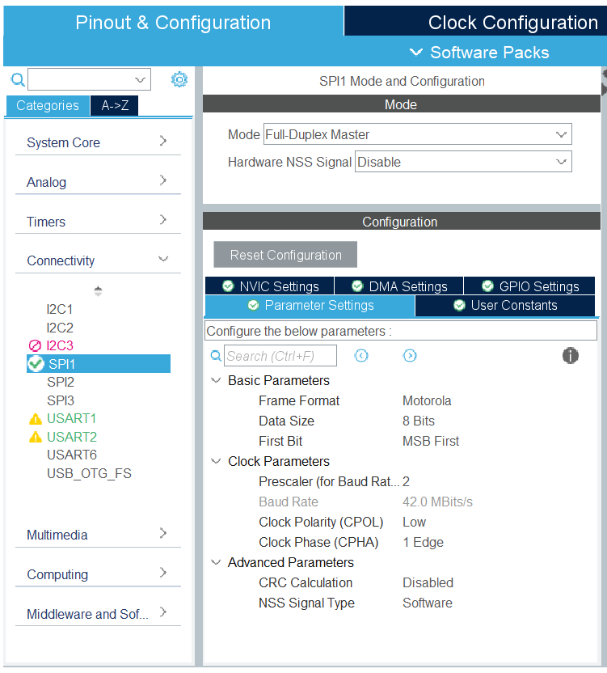


**SPI1 prescaler final: `/2` → 42 MBit/s** (bukan `/32` seperti rekomendasi awal yang konservatif — di hardware ternyata panel SSD1680 tetap normal di kecepatan ini, jadi nilai ini yang dipakai & terbukti jalan, bukan sekadar teori).

### Sensor XY-MD02 (Modbus RTU / RS485) — USART2

| Pin MCU | Fungsi |
|---|---|
| PA2 | TX |
| PA3 | RX |

Baudrate: **9600 8N1** (confirmed). Device address Modbus: `0x01` (default XY-MD02).

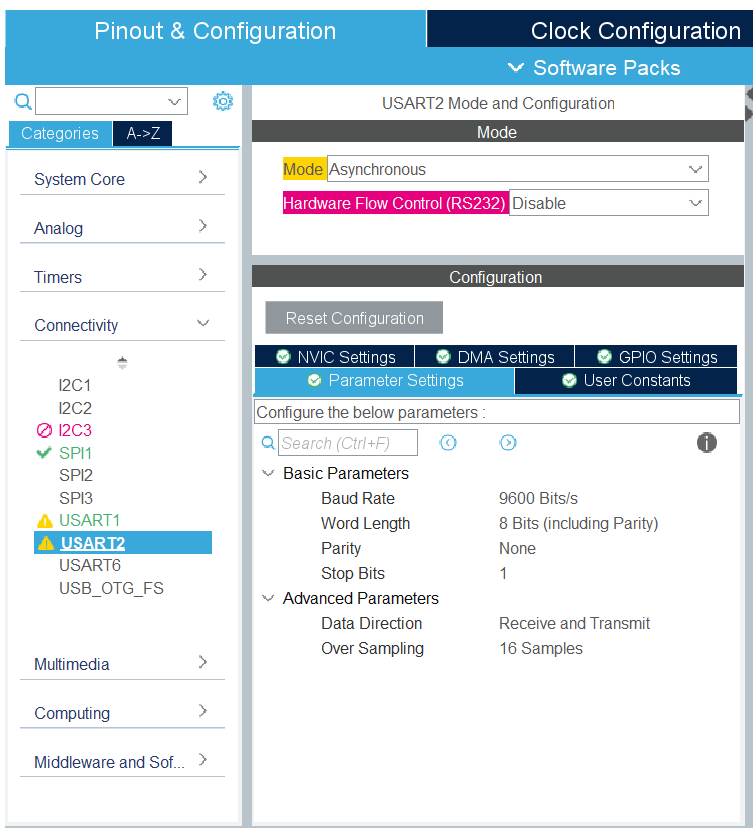


**Catatan:** tidak ada kontrol GPIO manual untuk arah DE/RE modul RS485 transceiver di kode ini — cocok untuk modul auto-direction-sensing (mis. berbasis MAX13487). Kalau modul RS485 kamu tipe manual DE/RE (mis. MAX485 biasa), perlu tambahan GPIO toggle sebelum `HAL_UART_Transmit`.

Perilaku normal: sesekali muncul `TIMEOUT`/`CRC_ERROR` di log (noise RS485 sesaat, terlihat juga di screenshot serial di atas) — ini **tidak dianggap error fatal**, data lama tetap dipertahankan sampai baca berikutnya sukses (lihat `StartSensorTask` di `main.c`).

### Debug Print — USART1

| Pin MCU | Fungsi |
|---|---|
| PA9  | TX |
| PA10 | RX |

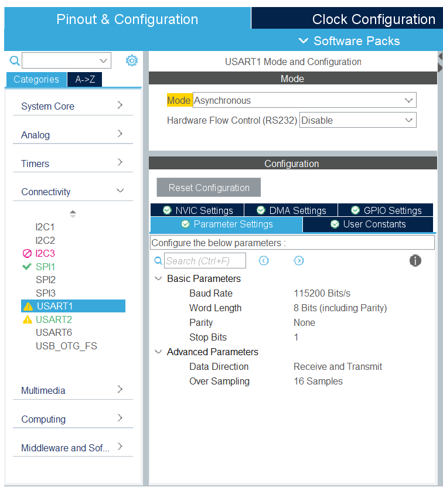

Baudrate: **115200 8N1** (confirmed, lihat screenshot Hercules di atas). `printf()` di-retarget ke sini lewat `__io_putchar()` (lihat `main.c`, `USER CODE BEGIN 4`).

## FreeRTOS Task Design

| Task | Priority | Stack | Perilaku |
|---|---|---|---|
| `SensorTask` | `osPriorityNormal` | 512 word | `sensor_read()` tiap 10 detik (`osDelayUntil`), tulis ke `g_latest_data` (dilindungi mutex) |
| `DisplayTask` | `osPriorityLow` | 1024 word | Baca `g_latest_data` (mutex) tiap 60 detik, `epd_wake()` → render → `epd_display()` → `epd_sleep()` |

Tidak ada shared bus antara SPI1 (epaper) dan USART2 (sensor) → tidak ada risiko priority inversion dari bus contention. Tidak pakai pola mediator/protocol-layer — disepakati overkill untuk scope standalone sensor-ke-display ini.

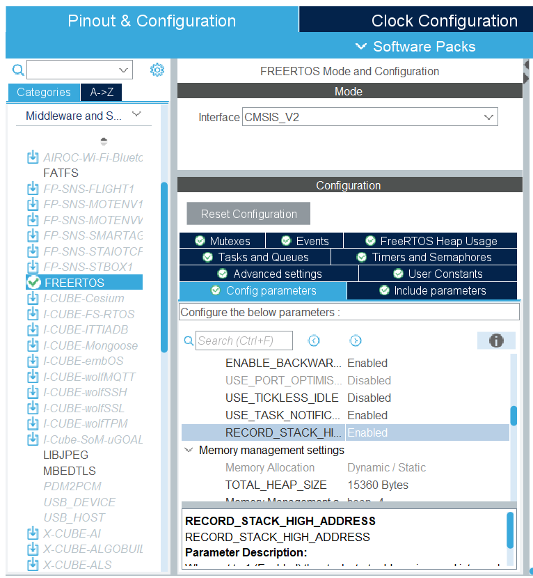
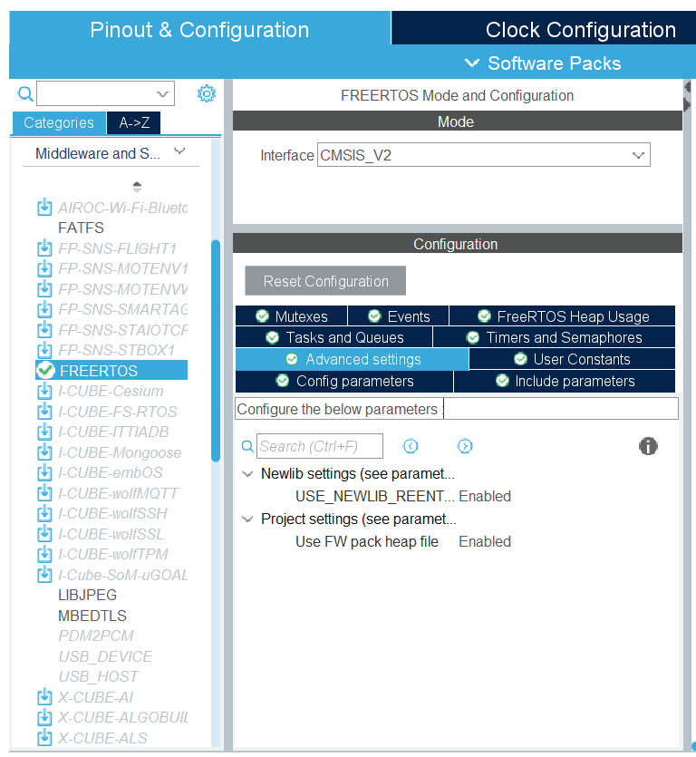


FreeRTOS heap: 15360 byte (default CubeMX), Interface: CMSIS_V2, `USE_NEWLIB_REENTRANT` **Enabled** — penting karena `printf`/`snprintf` dipanggil dari dua task berbeda (Sensor & Display), setting ini bikin newlib thread-safe di FreeRTOS.

## Struktur Folder

```
Core/
├── Inc/
│   ├── main.h
│   ├── epaper.h          # pin mapping + API epaper (port dari ESP32)
│   ├── epaper_gfx.h       # drawing primitives (font, garis, bentuk) — reuse murni
│   └── sensor.h           # Modbus RTU XY-MD02
└── Src/
    ├── main.c             # FreeRTOS setup, SensorTask, DisplayTask, RenderSensorData
    ├── epaper.c            # driver SSD1680, hasil port ESP-IDF → STM32 HAL
    ├── epaper_gfx.c        # reuse langsung, tanpa perubahan
    └── sensor.c            # Modbus RTU (CRC16, request/response parsing)
docs/
├── PIN_MAPPING.md          # histori keputusan pin/clock/priority secara detail
└── images/                 # screenshot CubeMX + foto hasil pengujian
```

`Drivers/`, `Middlewares/Third_Party/FreeRTOS/`, `.ioc`, `.project`, `.cproject` adalah hasil generate STM32CubeIDE/CubeMX — tidak disertakan di sini, timpa/gabungkan `Core/` di atas ke project CubeMX kamu.

## Build & Flash

1. Project STM32CubeIDE untuk STM32F401CCU6, `.ioc` dengan FreeRTOS (CMSIS_V2), SPI1, USART1, USART2 enabled sesuai tabel pin di atas.
2. Generate code dari CubeMX.
3. Timpa/gabungkan `Core/Inc/` dan `Core/Src/` project ini ke folder `Core/` hasil generate.
4. Pastikan include `epaper.h`, `epaper_gfx.h`, `sensor.h`, `<stdio.h>` ada di `USER CODE BEGIN Includes` (main.c) — supaya tidak hilang kalau generate ulang.
5. Build (Clean + Build Project), flash ke board.
6. Buka serial monitor di USART1 (115200 8N1) untuk lihat log status sensor/display.

